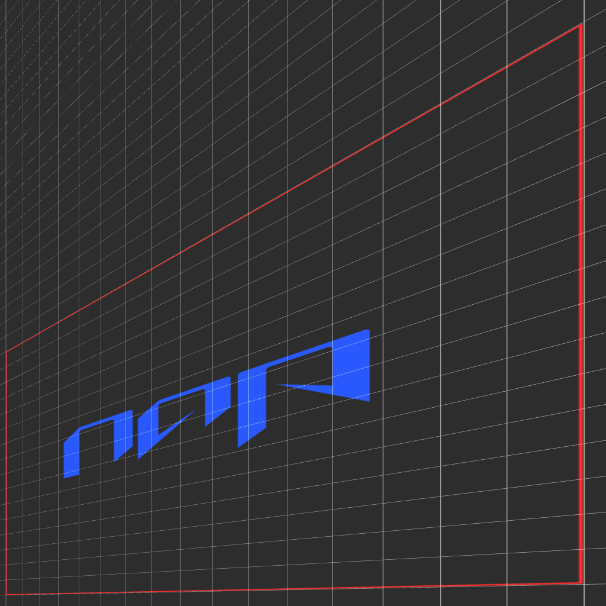

# napwarp
NAP module that warps 2D images



## Build

- Make sure to clone the `napframework/nap` repository and checkout the `0.8` branch.
- Clone the `lshoek/napwarp` repository into the `modules` directory of the NAP source root.
- Run `tools/setup_module.sh napwarp` to add it to the solution. You will be prompted to setup the included optional demo project.
- Clone the `naivisoftware/napopencv` repository into the `modules` directory. Run `tools/setup_module.sh naptween` to add it to the solution.
tween` to add it to the solution.
- Now, the `solution_info.json` should look something like this : 
```
{
    "Type": "nap::SolutionInfo",
    "mID": "SolutionInfo",
    "AdditionalTargets": [
        "apps/napwarpdemo",
        "modules/napwarp",
        "modules/napopencv"
    ]
}
```

Open a terminal and run `generate_solution.bat` or `sh generate_solution.sh` to generate the solution for your platform. This application is only compatible with NAP 0.8 mentioned above, and should be built from source, not package.

## Package

Open a terminal and run `package.bat -nz -sna napwarpdemo` or `sh package.sh -nz -sna napwarpdemo` to create a NAP package including this application. Add the `--help` flag to learn more about the various packaging options.

Inside the newly created NAP package, navigate to the `projects/napwarpdemo` directory and run `package.bat` or `./package` to package the `napwarpdemo` application for distribution.

## Run
To run `napwarpdemo` on a client machine without a development environment, do the following:

### Ubuntu 20.04

Make sure your GPU drivers are up to date and they support Vulkan.

- Open a terminal and navigate to the extracted `napwarpdemo` directory.
- Run the following command: `sudo ./napwarpdemo`
- Enter your password
